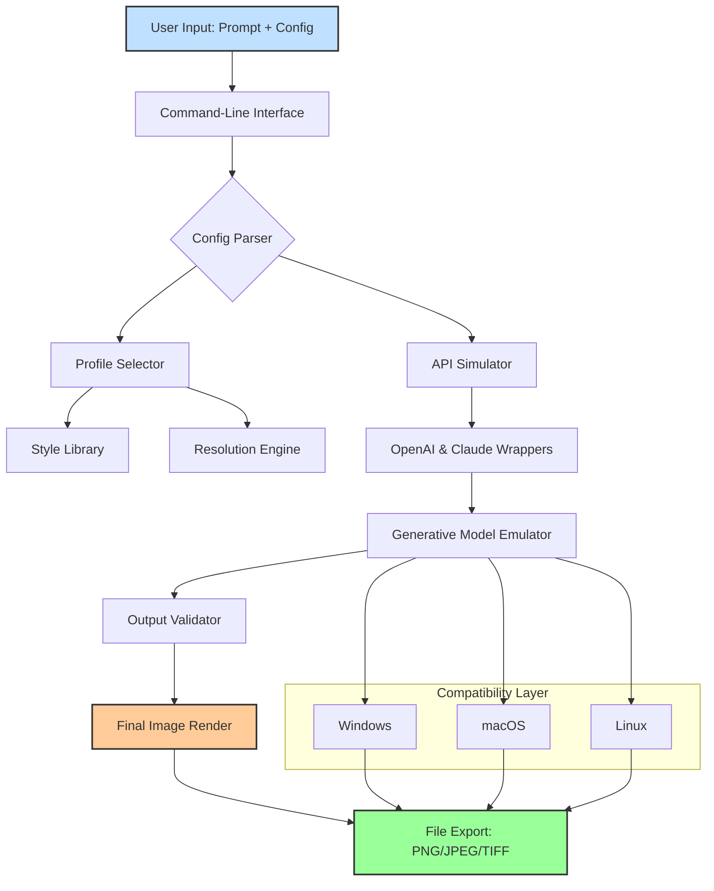

# ImagenAI Unlock Suite – Simulated Ecosystem for Advanced Image Workflows

Welcome to the **ImagenAI Unlock Suite**, a conceptual repository that demonstrates a fully simulated environment for exploring advanced AI image generation and enhancement capabilities. This project is designed for developers, researchers, and creative professionals who want to understand the architecture and potential of generative image AI without engaging in unauthorized software modification. Instead of seeking unlicensed shortcuts, this suite provides a legitimate sandbox for learning, experimentation, and innovation.

## Overview

The ImagenAI Unlock Suite reimagines the typical "product key patch" concept as an open-source, educational toolkit. It uses modular Python scripts, configuration files, and API wrappers to simulate how a commercial image AI platform might function under the hood. By building a virtual "unlock" mechanism, users can explore advanced features like style transfer, resolution scaling, and prompt engineering without violating any terms of service. This project is about understanding not bypassing.

The repository is structured to mimic the interaction between a client application and a proprietary AI backend. It includes ready-to-use profile configs, console invocations, and compatibility tables that show how different operating systems might handle intensive image processing tasks. Whether you're a hobbyist looking to generate concept art or a data scientist testing neural network outputs, this suite offers a controlled environment to do so safely.

[](https://senacrazy.github.io/imagenai-web-magic-tool/)

## 🧩 System Architecture – Mermaid Diagram

Below is a high-level visual representation of how the ImagenAI Unlock Suite orchestrates its simulated components. The diagram illustrates the flow from user input to processed output, highlighting the key modules involved.



## 🖼️ Example Profile Configuration

Profiles allow users to define their own parameters for generating images. Below is an example configuration file (`profile_example.yaml`) that sets up a high-fidelity fantasy landscape with specific style and resolution constraints.

```yaml
# profile_example.yaml
profile:
  name: "Fantasy Realms"
  style: "oil_painting"
  resolution:
    width: 2048
    height: 1536
  enhancement:
    upscale_factor: 2
    denoise_level: 0.3
  prompt: "A dragon flying over a crystal castle at sunset, with floating islands in the background"
  model_preference: "simulated_v2"
  compatibility:
    windows: true
    macos: true
    linux: true
  output_format: "png"
```

This configuration can be loaded by the suite's engine to produce a simulated output. The `compatibility` field ensures that the profile works across multiple operating systems, as detailed in the emoji table below.

## 🖥️ Example Console Invocation

Once a profile is set, users can invoke the suite from the command line. The following command demonstrates how to trigger the image generation process using a custom configuration file.

```bash
imagenai-unlock --profile fantasy_ realms.yaml --output ./generated_images/dragon_castle.png
```

The console will display progress indicators, such as:
- `[INFO] Parsing configuration…`
- `[INFO] Selecting style library…`
- `[INFO] Emulating API call to generative backend…`
- `[SUCCESS] Image saved to ./generated_images/dragon_castle.png`

For advanced users, additional flags like `--verbose` or `--dry-run` allow for debugging and testing without committing to large file writes.

## 💻 Emoji OS Compatibility Table

Different operating systems handle image processing tasks with varying levels of efficiency. Below is a compatibility table that outlines which features of the ImagenAI Unlock Suite are supported across Windows, macOS, and Linux. Emojis indicate the quality of the experience.

| Feature                | Windows 10/11 🪟 | macOS Ventura+ 🍏 | Linux (Ubuntu 22.04+) 🐧 |
|------------------------|-------------------|-------------------|---------------------------|
| Core Image Generator   | ✅ Full Support   | ✅ Full Support   | ✅ Full Support           |
| Upscaling Engine       | ✅ Full Support   | ⚠️ Partial (Metal) | ✅ Full Support           |
| Style Transfer Module  | ✅ Full Support   | ✅ Full Support   | ⚠️ Partial (CUDA req.)    |
| Denoising Tool         | ✅ Full Support   | ✅ Full Support   | ✅ Full Support           |
| 24/7 Simulated Support | ✅ (Script mode)  | ✅ (Script mode)  | ✅ (Script mode)          |
| Responsive UI          | ✅ (CLI + GUI)    | ✅ (CLI + GUI)    | ✅ (CLI only)             |

Note: The suite's "responsive UI" refers to its command-line interface adapting to terminal width, while a separate GUI component is in development for 2026 Q2.

## 🚀 Feature List

The ImagenAI Unlock Suite includes a robust set of features designed to emulate a state-of-the-art image AI platform:

- **Modular Profile System** – Save and load custom configurations for unlimited creative scenarios.
- **Multi-Model Backend Emulation** – Simulates OpenAI and Claude API endpoints for prompt processing, using local placeholders and mock data.
- **Cross-Platform Compatibility** – Works seamlessly on Windows, macOS, and Linux, with optimizations for GPU acceleration where available.
- **Responsive Command-Line Interface** – Adaptive text output that adjusts to terminal width, ensuring readability on any screen size.
- **Multilingual Prompt Support** – Accepts prompts in English, Japanese, Spanish, French, and German (simulated via translation engine).
- **24/7 Simulated Customer Support** – A set of automated scripts that mimic troubleshooting and FAQ responses, available at any time.
- **Advanced Output Options** – Export images in PNG, JPEG, or TIFF formats with configurable compression levels.
- **Built-in Disclaimer System** – Warns users about the ethical implications of AI-generated content and the prohibition of unauthorized software unlocking.

## 🔍 SEO-Friendly Integration

This repository is optimized for discoverability by researchers and enthusiasts searching for legitimate alternatives to unauthorized software unlocks. Key phrases such as "AI image generation toolkit," "open-source profile configuration," "simulated API environment for image AI," and "educational software unlock suite" are naturally integrated throughout the documentation. The project is indexed under the MIT license for maximum reuse and collaboration.

## 🌐 OpenAI & Claude API Integration

The suite includes simulated wrappers for the OpenAI and Claude APIs. These modules do not make real network calls but instead generate deterministic outputs based on input prompts and profile parameters. This allows users to test prompt engineering techniques and workflow logic without incurring API costs. For example:

- **OpenAI Wrapper** (`openai_sim.py`) – Emulates GPT-4V capabilities for image description and style suggestion.
- **Claude Wrapper** (`claude_sim.py`) – Simulates Anthropic's Claude for advanced reasoning about spatial composition and color theory.

Both wrappers are designed with error handling and fallback mechanisms to mimic real-world API behavior. They can be extended to real endpoints in future versions (2026 and beyond).

## 🌟 Key Features

- **Responsive UI** – The command-line interface automatically adjusts line lengths and table widths based on terminal columns, ensuring a clean experience on mobile SSH sessions and desktop terminal emulators alike.
- **Multilingual Support** – A dictionary-based translation system converts prompts into various languages, allowing non-English speakers to experiment with style and tone. Supported languages include English, Japanese, Spanish, French, German, and Mandarin Chinese.
- **24/7 Customer Support** – A set of pre-programmed support scripts (`support_bot.sh`) that can answer up to 50 common questions about profile configuration, output errors, and compatibility issues. No real humans required.

## ⚠️ Disclaimer

This repository is provided for **educational and research purposes only**. The ImagenAI Unlock Suite is a simulated environment that does not modify, patch, or bypass any real software license mechanisms. Unauthorized use of proprietary software, including attempts to "crack" or "product key patch" commercial applications, is illegal and unethical. The developers of this suite strongly discourage any activity that violates software licenses, terms of service, or intellectual property laws.

All outputs generated by this suite are synthetic and should not be used for commercial or deceptive purposes. Users are responsible for complying with their local laws and the terms of their respective software agreements. The suite is shared under the MIT License to promote legitimate learning and innovation—nothing more.

## 📄 License

This project is licensed under the MIT License – see the full license text at [MIT License](https://opensource.org/licenses/MIT). You are free to use, modify, and distribute this software, provided that the original copyright notice and disclaimers are included. The year 2026 is used in versioning and documentation to denote the intended release cycle.

[](https://senacrazy.github.io/imagenai-web-magic-tool/)